# Alea's Intelligence

## Project Description

**Alea's Intelligence** is a dedicated application crafted to streamline communication with Artificial Intelligence. It's specifically designed to leverage APIs from various platforms, enabling seamless interaction with multiple AI models simultaneously. Currently, it integrates with **OpenRouter AI** and **Groq**, providing a versatile interface for diverse AI capabilities.

Notably, this application is built entirely from the ground up using **native code**, without the assistance of any external frameworks. This approach allows for a lean and focused implementation.

## Key Features

- **Multi-Model AI Communication**  
  Facilitates user interaction with different AI models concurrently, sending messages and receiving comprehensive responses.

- **Audio Transcription**  
  Utilizes Whisper AI to convert spoken input into text, preparing it for further processing by the integrated AI models.

- **Intelligent Memory System**  
  Manages conversation history and identifies pinned topics, ensuring that the AI receives relevant context for ongoing dialogues.

## System Flow Diagrams

### AI Communication Flow

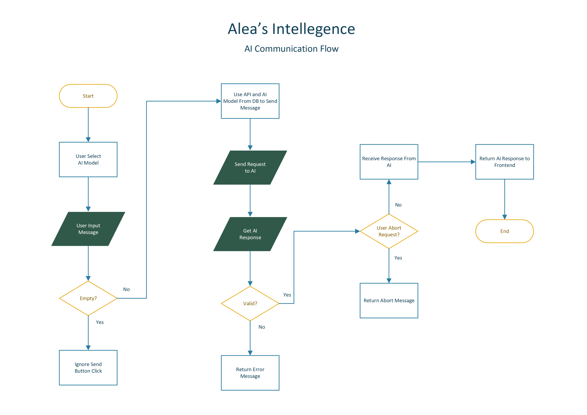

This diagram illustrates how user messages are processed, dispatched to the AI, responses are received, and subsequently returned to the user interface. The flow incorporates robust input validation and mechanisms for handling request cancellations.

### Audio Transcript Flow

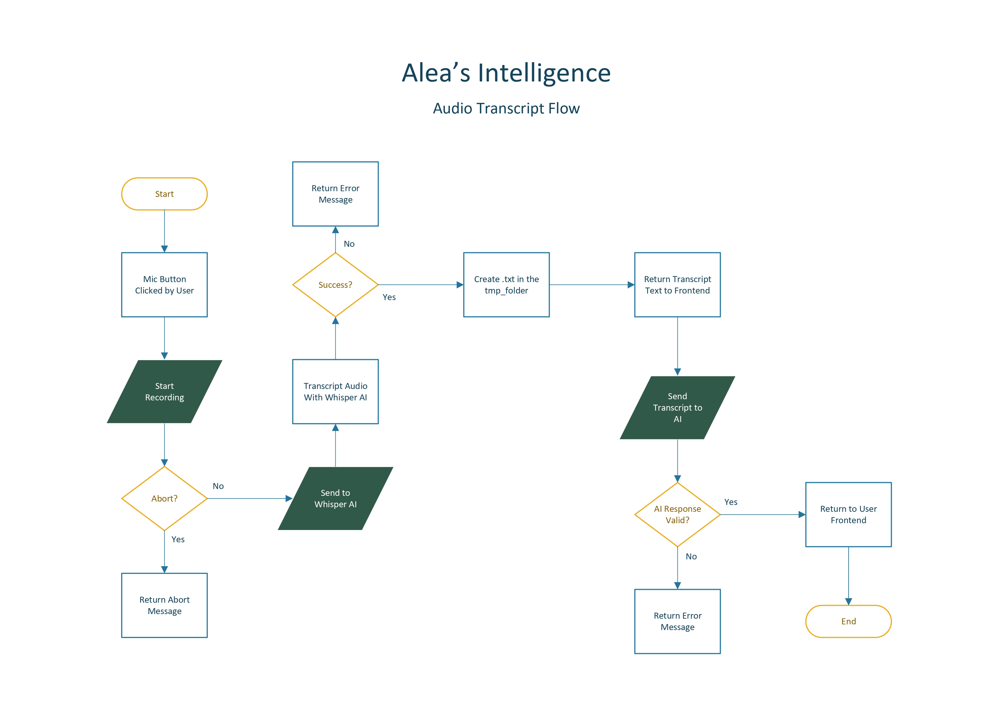

This diagram outlines the comprehensive audio transcription process. It begins with audio input from the user, proceeds with transcription using Whisper AI, and then transmits the transcribed text to the AI model for further action.

### Memory System Flow

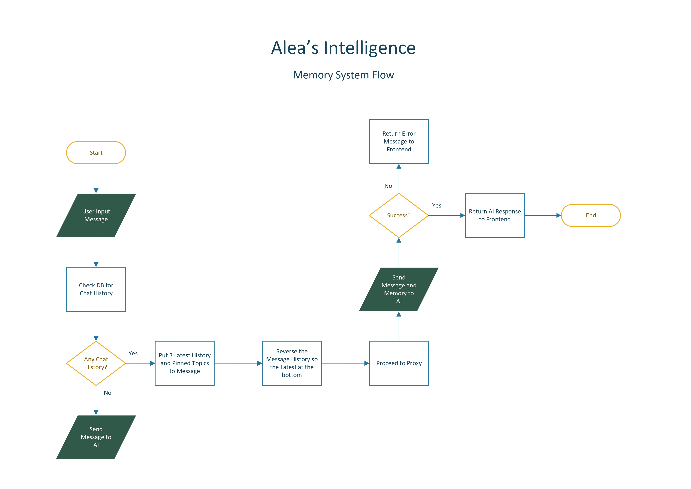

This diagram details how the memory system efficiently manages chat history. It intelligently checks for existing conversational context, integrates the three most recent chat histories along with any pinned topics into the current message, and forwards this enriched data to the AI proxy.

---

## System Requirements

- This project is built upon a **LEMPP stack** (Linux, Nginx, MySQL, PHP, PHPMyAdmin) to ensure optimal functionality and performance.
- Whisper AI enables audio transcription (speech-to-text) from user input. However, the application remains fully functional without voice recognition.

---

### Web Server Configuration (Nginx)

- `client_max_body_size 50M`: Configures the maximum permissible size for client request bodies, accommodating larger data transfers.
- Dedicated server blocks are implemented for enhanced security, utilizing distinct domains for public and private folders.  
  - **Public folder**: Where users interact with the AI application  
  - **Private folder**: Used for managing AI APIs and models

### PHP Configuration

**CLI and FPM (`php.ini`)**

- `upload_max_filesize = 50M`: Sets the maximum allowed size for file uploads.
- `post_max_size = 50M`: Defines the maximum size for POST data, crucial for handling larger requests.

> ⚠️ Ensure that `php-curl` is properly installed for robust communication capabilities.

### MySQL Configuration

- **Database**: `intelligence_db`  
  Designated as the default database for the project, centralizing data storage.

- Installation of **phpMyAdmin** is highly recommended for efficient and user-friendly database management.

---

## Whisper AI Installation

To set up Whisper AI for audio transcription, follow these steps:

### 1. Install System Dependencies:

```bash
sudo apt update && sudo apt install ffmpeg python3-pip python3-venv -y
```

### 2. Create a New Virtual Environment:

```bash
cd /var/www/
python3 -m venv whisper-env
source whisper-env/bin/activate
```

### 3. Upgrade Pip:

```bash
pip install --upgrade pip
```

### 4. Install Torch:

#### With CUDA (for GPU acceleration):

```bash
pip install torch torchvision torchaudio
```

#### Without CUDA (CPU-only):

```bash
pip install torch torchvision torchaudio --index-url https://download.pytorch.org/whl/cpu
```

### 5. Install Whisper AI from GitHub:

```bash
pip install git+https://github.com/openai/whisper.git
```

### 6. Grant Access Permissions for Whisper AI:

```bash
sudo chown -R www-data:www-data whisper-env
sudo chmod -R 755 whisper-env
```

### 7. Grant Permissions for the Application:

```bash
sudo chown -R www-data:www-data /var/www/aleas-intelligence
sudo chmod -R 755 aleas-intelligence
```

### 8. Test Installation

Upon completing the installation, install the base Whisper AI model and verify its functionality by transcribing an audio file into text before integrating it into the main application.

---

## Usage

To set up and run **Alea's Intelligence**, follow these steps:

### 1. Place the Repository in Your Web Server Directory

Clone or copy this repository into your web server's root directory, commonly:

```bash
/var/www/aleas-intelligence/
```

Make sure the directory structure remains intact, especially the separation between public and private folders.

**After placing the repository in your web server directory, configure the connect.php file with your database credentials to enable data connectivity.**

### 2. Set Proper Permissions

Ensure that the server has the appropriate read/write permissions:

```bash
sudo chown -R www-data:www-data /var/www/aleas-intelligence
sudo chmod -R 755 /var/www/aleas-intelligence
```

### 3. Import the Database

Using **phpMyAdmin** or the MySQL CLI, import the provided SQL file (`intelligence_db.sql`) into your MySQL server:

```bash
mysql -u root -p intelligence_db < /path/to/intelligence_db.sql
```

Make sure the database `intelligence_db` is created before running the import.

### 4. Add API Credentials and AI Models via Admin Panel

Open the **admin/private panel** in your browser (e.g., `http://yourdomain.com/private/`) and log in (no authentication is required by default — you can implement it if needed).

From there:

- Navigate to the **API Management** section
- Add one or more APIs with the following **required fields**:
  - `model_name` (e.g., `gpt-4`, `llama3-70b`)
  - `api_key` (get this from [OpenRouter](https://openrouter.ai) or [Groq](https://console.groq.com))
  - `url` (base URL for the API provider)

Example for OpenRouter:
- `model_name`: `mistralai/mixtral-8x7b`
- `api_key`: `sk-...`
- `url`: `https://openrouter.ai/api/v1/chat/completions`

Example for Groq:
- `model_name`: `llama3-70b-8192`
- `api_key`: `gsk_...`
- `url`: `https://api.groq.com/openai/v1/chat/completions`

> The system uses `curl` to communicate with the external APIs, so ensure all credentials are correct.

### 5. Configure PHP (If Not Yet Done)

Make sure your `php.ini` includes:

```ini
upload_max_filesize = 50M
post_max_size = 50M
```

Also make sure `php-curl` is installed:

```bash
sudo apt install php-curl
```

### 6. Start Using the Application

Navigate to your **public folder** (e.g., `http://yourdomain.com/`) to interact with the AI system. You can:

- Send messages to different AI models
- Upload audio to be transcribed
- View context-aware replies thanks to the integrated memory system

Make sure your web server (e.g., **Nginx**) is properly serving both the public and private directories with appropriate security settings.

> ⚠️ For security, do not expose your private admin panel (`/private/`) to the public internet without restricting access.

---

You’re now ready to use **Alea's Intelligence** to interact with multiple AI models in a streamlined and dynamic environment!

## Preview

### Light Mode
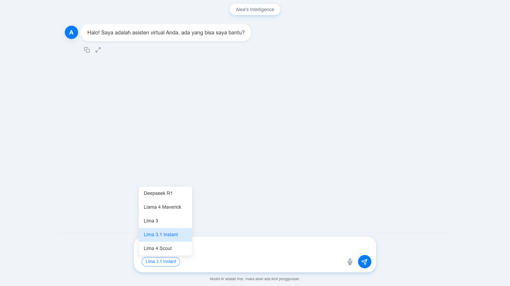

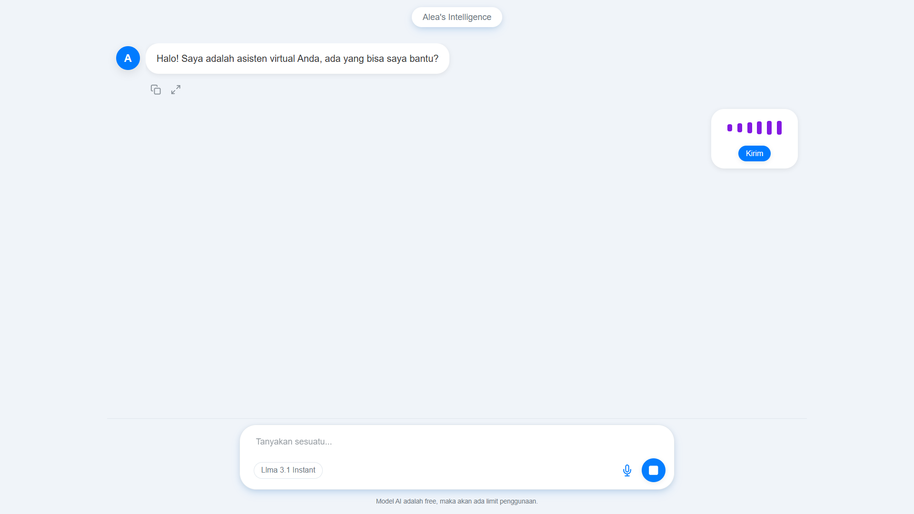

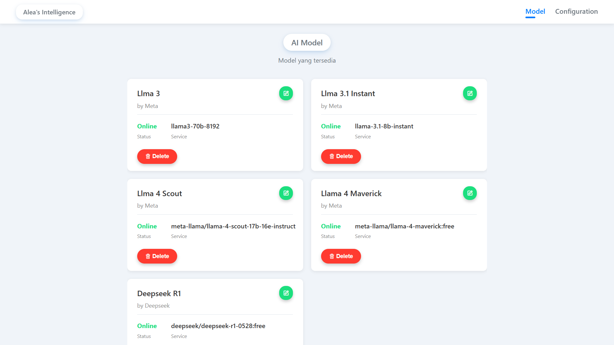

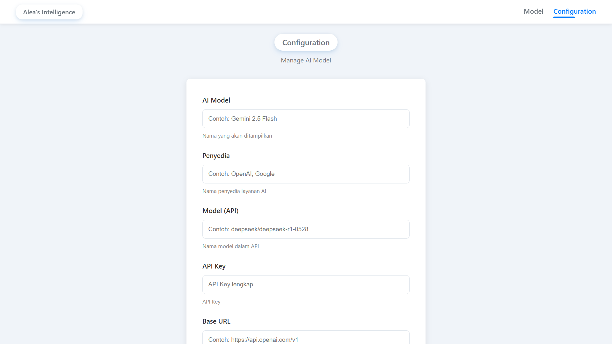

### Dark Mode
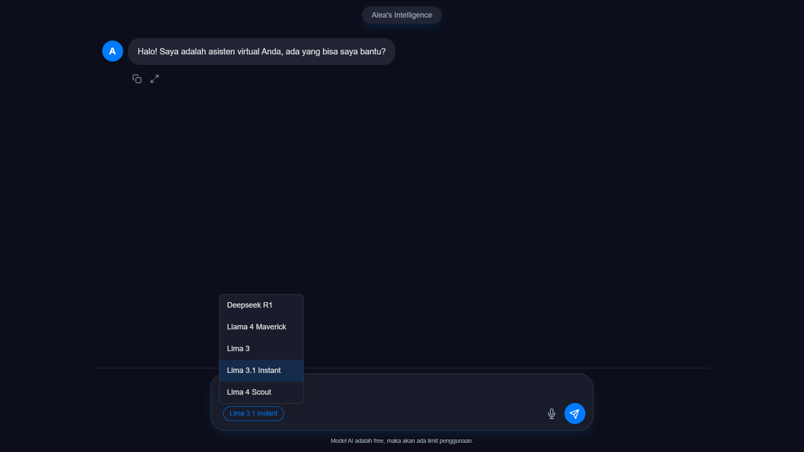

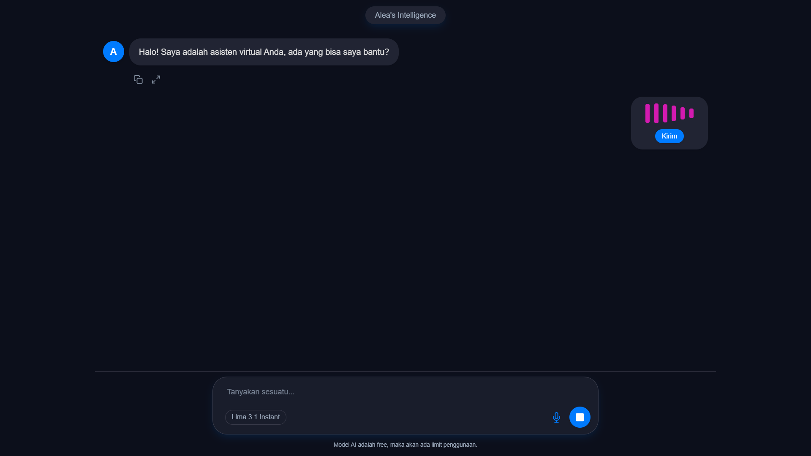

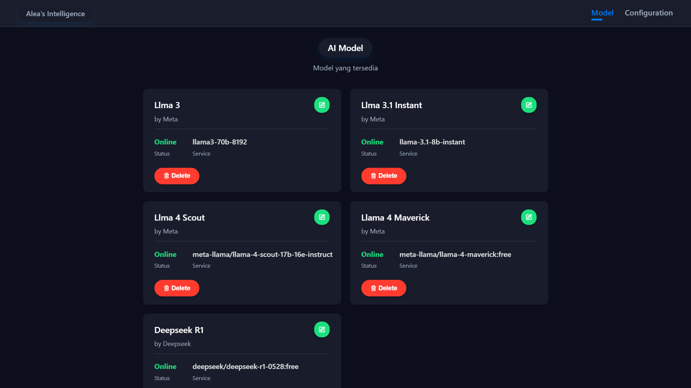

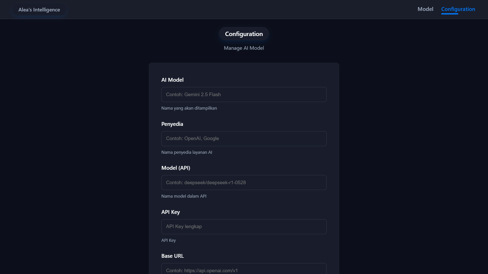

---

## Contributing

This project is a labor of passion, shared with the community out of pure hobby interest. As such, there is currently no dedicated login portal implemented. If you are interested in contributing to this aspect or any other part of the project, your contributions are highly welcome!

> Please note: I am sharing this project purely out of personal interest, and I am **not a professional programmer**—in fact, I don't even code. This project is a testament to what can be achieved through exploration and enthusiasm.

## License

This project was created entirely out of personal passion. I am not a programmer, and truthfully, I might not even know how to code. You're completely free to use, modify, or distribute this project as you wish.

I genuinely hope you enjoy using it. If you do, feel free to reach out to me via Instagram DM. 😊
